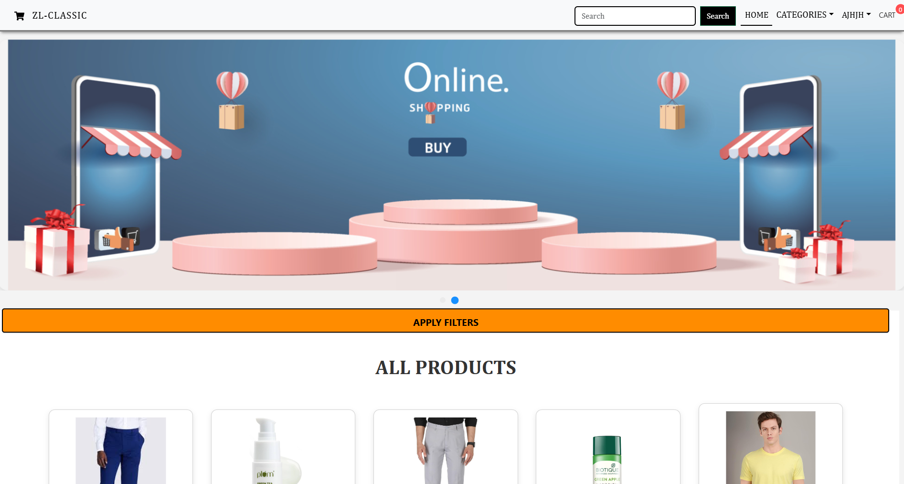
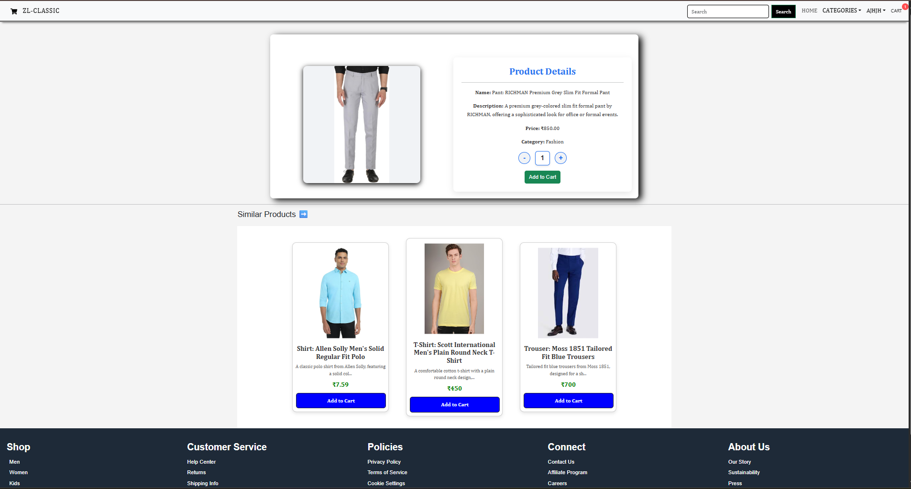
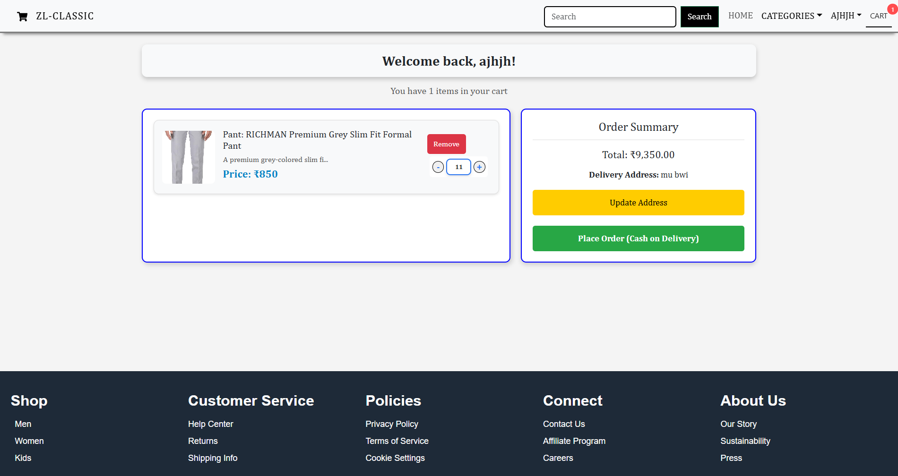
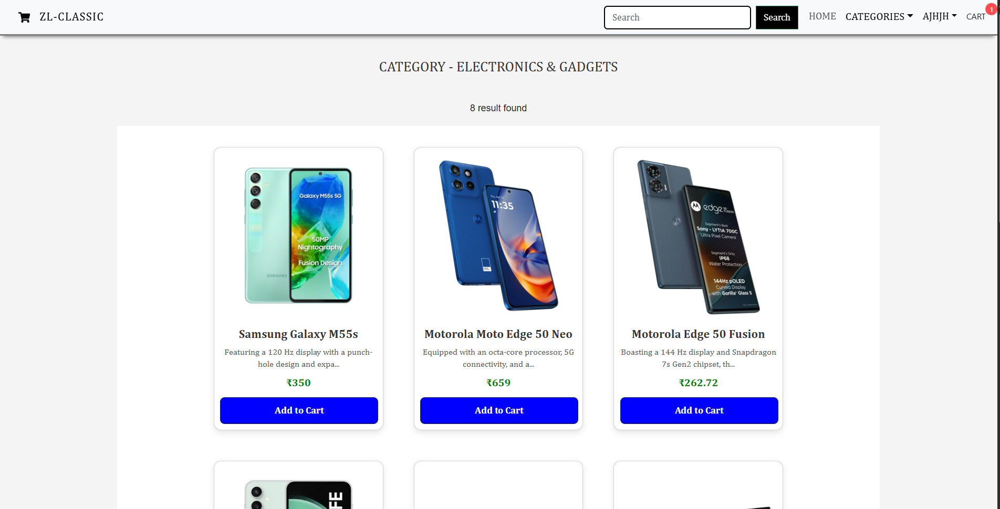

# 🛒 ZL-Classic E-Commerce Platform

A full-stack MERN (MongoDB, Express, React, Node.js) e-commerce application with a modern UI, complete shopping cart functionality, user authentication, and admin dashboard.

## 🌟 Features

### Customer Features
- 🏠 **Home Page** with featured products and carousel
- 🔍 **Product Search** and filtering by categories
- 📦 **Product Details** with similar product recommendations
- 🛍️ **Shopping Cart** with quantity management
- 💳 **Cash on Delivery** checkout system
- 👤 **User Authentication** (Register/Login)
- 📋 **Order History** and tracking
- 📱 **Responsive Design** for mobile and desktop

### Admin Features
- 📊 **Admin Dashboard** with overview
- 📦 **Product Management** (Create, Update, Delete)
- 🏷️ **Category Management**
- 📸 **Image Upload** for products
- 👥 **User Management**
- 📦 **Order Management** with status updates
- 📈 **Order Analytics**

## 🖼️ Screenshots

### Home Page

*Browse through featured products with a beautiful carousel and category filters*

### Product Details

*View detailed product information with similar product recommendations*

### Shopping Cart

*Manage cart items with quantity controls and see order summary*

### Category Page

*Filter products by categories with responsive product grid layout*

## 🚀 Tech Stack

### Frontend
- **React** 18.2.0 - UI Library
- **React Router DOM** 6.30.0 - Routing
- **Axios** - HTTP Client
- **Ant Design** - UI Components
- **React Hot Toast** - Notifications
- **React Helmet** - SEO Management

### Backend
- **Node.js** - Runtime Environment
- **Express.js** - Web Framework
- **MongoDB** - Database
- **Mongoose** - ODM
- **JWT** - Authentication
- **Bcrypt** - Password Hashing
- **Express Formidable** - File Upload

## 📦 Installation

### Prerequisites
- Node.js (v14 or higher)
- MongoDB (Local or Atlas)
- npm or yarn

### 1. Clone the Repository
```bash
git clone https://github.com/ajitkumar7432/zl-classic-ecomm.git
cd zl-classic-ecomm
```

### 2. Install Dependencies

**Install server dependencies:**
```bash
npm install
```

**Install client dependencies:**
```bash
cd client
npm install
cd ..
```

### 3. Environment Variables

Create a `.env` file in the root directory:

```env
PORT=8080
DEV_MODE=development
MONGO_URL=mongodb://localhost:27017/zlclassic
JWT_SECRET=your_jwt_secret_key_here
```

### 4. Seed Database (Optional)

To populate the database with sample data:

```bash
node seedData.js
```

This will create:
- 5 sample categories (Electronics, Clothing, Books, Home & Kitchen, Sports)
- 10 sample products

### 5. Run the Application

**Development mode (runs both server and client):**
```bash
npm run dev
```

**Production mode:**
```bash
# Build the client
npm run build

# Start the server
npm start
```

The application will be available at:
- **Frontend:** http://localhost:3000
- **Backend API:** http://localhost:8080

## 📁 Project Structure

```
zl-classic-ecomm/
├── client/                 # React frontend
│   ├── public/            # Static files
│   ├── src/
│   │   ├── components/    # Reusable components
│   │   ├── context/       # Context API (Auth, Cart, Search)
│   │   ├── pages/         # Page components
│   │   ├── styles/        # CSS files
│   │   └── App.js         # Main app component
│   └── package.json
│
├── config/                # Database configuration
├── controllers/           # Route controllers
├── helpers/              # Helper functions
├── middlewares/          # Custom middlewares
├── models/               # Mongoose models
├── routes/               # API routes
├── server.js             # Express server
├── seedData.js           # Database seeding script
└── package.json
```

## 🔑 API Endpoints

### Authentication
- `POST /api/v1/auth/register` - Register new user
- `POST /api/v1/auth/login` - User login
- `POST /api/v1/auth/forgot-password` - Password recovery
- `GET /api/v1/auth/user-auth` - Check user authentication
- `GET /api/v1/auth/admin-auth` - Check admin authentication

### Products
- `GET /api/v1/product/get-product` - Get all products
- `GET /api/v1/product/get-product/:slug` - Get single product
- `GET /api/v1/product/product-photo/:pid` - Get product image
- `POST /api/v1/product/create-product` - Create product (Admin)
- `PUT /api/v1/product/update-product/:pid` - Update product (Admin)
- `DELETE /api/v1/product/delete-product/:pid` - Delete product (Admin)
- `GET /api/v1/product/product-count` - Get product count
- `GET /api/v1/product/product-list/:page` - Get paginated products
- `POST /api/v1/product/product-filters` - Filter products
- `GET /api/v1/product/search/:keyword` - Search products

### Categories
- `GET /api/v1/category/get-category` - Get all categories
- `GET /api/v1/category/single-category/:slug` - Get single category
- `POST /api/v1/category/create-category` - Create category (Admin)
- `PUT /api/v1/category/update-category/:id` - Update category (Admin)
- `DELETE /api/v1/category/delete-category/:id` - Delete category (Admin)

### Orders
- `POST /api/v1/product/create-order` - Create new order
- `GET /api/v1/auth/orders` - Get user orders
- `GET /api/v1/auth/all-orders` - Get all orders (Admin)
- `PUT /api/v1/auth/order-status/:orderId` - Update order status (Admin)

## 👤 Default Admin Access

After seeding the database or registering, you can create an admin user by:

1. Register a new user
2. Update the user's `role` field in MongoDB to `1`:
```javascript
db.users.updateOne(
  { email: "admin@example.com" },
  { $set: { role: 1 } }
)
```

## 🎨 Key Features Implementation

### 1. **Authentication System**
- JWT-based authentication
- Password hashing with bcrypt
- Protected routes for users and admins
- Persistent login with localStorage

### 2. **Shopping Cart**
- Add/Remove products
- Quantity management
- Persistent cart (localStorage)
- Real-time total calculation

### 3. **Order Management**
- Cash on Delivery checkout
- Order history for users
- Order status tracking
- Admin order management with status updates

### 4. **Product Management**
- Image upload with formidable
- Category-based organization
- Search and filter functionality
- Pagination for product lists

### 5. **Responsive Design**
- Mobile-first approach
- Touch-friendly interface
- Adaptive layouts

## 🌐 Deployment

### Deploy to Vercel

1. Install Vercel CLI:
```bash
npm install -g vercel
```

2. Build the client:
```bash
cd client
npm run build
cd ..
```

3. Deploy:
```bash
vercel --prod
```

4. Add environment variables in Vercel dashboard:
   - `MONGO_URL`
   - `JWT_SECRET`
   - `PORT`
   - `DEV_MODE`

## 📝 Environment Variables

| Variable | Description | Required |
|----------|-------------|----------|
| `PORT` | Server port number | Yes |
| `DEV_MODE` | Environment mode (development/production) | Yes |
| `MONGO_URL` | MongoDB connection string | Yes |
| `JWT_SECRET` | Secret key for JWT tokens | Yes |

## 🤝 Contributing

Contributions are welcome! Please feel free to submit a Pull Request.

1. Fork the repository
2. Create your feature branch (`git checkout -b feature/AmazingFeature`)
3. Commit your changes (`git commit -m 'Add some AmazingFeature'`)
4. Push to the branch (`git push origin feature/AmazingFeature`)
5. Open a Pull Request

## 📄 License

This project is licensed under the MIT License.

## 👨‍💻 Author

**Ajitkumar Singh**
- GitHub: [@ajitkumar7432](https://github.com/ajitkumar7432)
- Email: singhajit29416@gmail.com

## 🙏 Acknowledgments

- React.js community
- MongoDB documentation
- Express.js framework
- Ant Design team
- All contributors and users

## 📞 Support

For support, email singhajit29416@gmail.com or create an issue in the repository.

---

⭐️ If you like this project, please give it a star!

**Live Demo:** [ZL-Classic E-Commerce](https://zl-classic-8vdzr4cfb-ajitkumar-singhs-projects.vercel.app)
